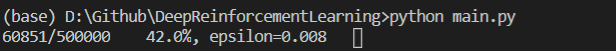

# Deep Reinforcement Learning
The homework of deep reinforcement learning course. *(based on example)*

----
## Homework #2 CarRacing-v0

### Learning

### Reduce the change of random learning.

### Luck needed

----
## Reference
