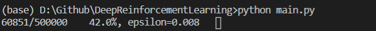
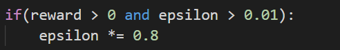
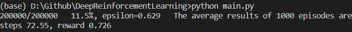

# Deep Reinforcement Learning
The homework of deep reinforcement learning course. *(based on example)*

----
## Homework #1 FrozenLake8x8

### Learning

> The value mean "epoch/all epoch", "accuracy", "current epsilon".

### Reduce the change of random learning.

> I think that if the agent got a right way to the target often, the agent should more belief of Q_table. When every time it got target, it reduce the random probability.

### Luck needed

> Get high score need some good luck.

----
## Reference

* https://morvanzhou.github.io/tutorials/machine-learning/reinforcement-learning/4-1-DQN1/
* https://medium.com/%E9%9B%9E%E9%9B%9E%E8%88%87%E5%85%94%E5%85%94%E7%9A%84%E5%B7%A5%E7%A8%8B%E4%B8%96%E7%95%8C/%E6%A9%9F%E5%99%A8%E5%AD%B8%E7%BF%92-ml-note-reinforcement-learning-%E5%BC%B7%E5%8C%96%E5%AD%B8%E7%BF%92-dqn-%E5%AF%A6%E4%BD%9Catari-game-7f9185f833b0
* https://pyliaorachel.github.io/blog/tech/python/2018/06/14/deep-q-learning.html